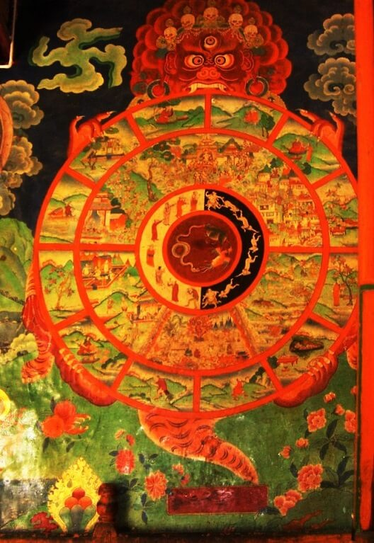

注：「灵性」翻译，有很多不准确的地方。如果你能帮我改善措辞我会很感激 →[地址](https://github.com/MaoKwen/maokwen.github.io/blob/master/_posts/2017-12-04-this-is-water.md)。

<small>There are these two young fish swimming along, and they happen to meet an older fish swimming the other way, who nods at them and says, "Morning, boys, how's the water?" And the two young fish swim on for a bit, and then eventually one of them looks over at the other and goes, "What the hell is water?"</small>

有两条小鱼在一起游，路过一条老鱼向他们点头问候：「早上好，孩子们，水怎么样？」然后这两条小鱼继续游了一会，终于其中一条忍不住好奇问另一条：「『水』是什么玩意？」

<small>If at this moment you're worried that I plan to present myself here as the wise old fish explaining what water is to you younger fish, please don't be. I am not the wise old fish. The immediate point of the fish story is that the most obvious, ubiquitous, important realities are often the ones that are the hardest to see and talk about. Stated as an English sentence, of course, this is just a banal platitude-but the fact is that, in the day-to-day trenches of adult existence, banal platitudes can have life-or-death importance. That may sound like hyperbole, or abstract nonsense. So let's get concrete...</small>

不要担心我试图自比老鱼，从而对你们展开长篇大论。放心吧，我从来就不是什么睿智的老鱼。

我选择这个故事是希望说明这样一点：人们常常容易忽略最明显、最普遍、最重要的事实。这句话与报纸电视互联网上随处可见的陈词滥调并无不同——但事实是，在日复一日的、成年人的战斗中，再平庸的陈词滥调也攸关生死。

这可能听起来像是夸张或抽象的废话，所以让我们具体展开谈谈……

<small>A huge percentage of the stuff that I tend to be automatically certain of is, it turns out, totally wrong and deluded. Here's one example of the utter wrongness of something I tend to be automatically sure of: Everything in my own immediate experience supports my deep belief that I am the absolute center of the universe, the realest, most vivid and important person in existence. We rarely talk about this sort of natural, basic self centeredness, because it's so socially repulsive, but it's pretty much the same for all of us, deep down. It is our default-setting, hard-wired into our boards at birth. Think about it: There is no experience you've had that you were not at the absolute center of. The world as you experience it is right there in front of you, or behind you, to the left or right of you, on your TV, or your monitor, or whatever. Other people's thoughts and feelings have to be communicated to you somehow, but your own are so immediate, urgent, real-you get the idea. But please don't worry that I'm getting ready to preach to you about compassion or other-directedness or the so-called "virtues." This is not a matter of virtue-it's a matter of my choosing to do the work of somehow altering or getting free of my natural, hard-wired default-setting, which is to be deeply and literally self-centered, and to see and interpret everything through this lens of self.</small>

事实证明，我认为理所当然的东西中，有很大一部分是完全错误的。比如，出于我所有的经历、体验与感受，我曾认为：我是宇宙的中心，是这个世界上最真实、最生动、最重要的人。尽管出于社会道德伦理，我们都不愿意承认这一点，但是这种原始的自我中心倾向存在于我们每个人的内心深处。这是我们的出厂设置、打出生起就焊死在我们的电路板上。请想一想：在你的所有人生经历中，有哪一次自己不在体验的中心？对你的经历而言，整个世界就在你面前，或者在你身后，或者在你的左右，或者在你的电视上，或者在你的显示器上……诸如此类。他人的想法和感受必须以某种方式传达给你才能令你察觉得到，但是你自己的想法和感受却是最直接、最紧迫、最真实的——你应该懂我的意思了。

但是请不要担心我要向你们传教，讲述慈悲、同情、利他主义或另外的什么被人们归为「美德」的东西。这无关于什么美德——这关乎我的选择，选择以某种方法修改或者摆脱我与生俱来的默认设置——这种默认设置让我把自己视为宇宙的中心，让我仅仅透过自己那狭小的镜头来看待一切、解释一切。

<small>By way of example, let's say it's an average day, and you get up in the morning, go to your challenging job, and you work hard for nine or ten hours, and at the end of the day you're tired, and you're stressed out, and all you want is to go home and have a good supper and maybe unwind for a couple of hours and then hit the rack early because you have to get up the next day and do it all again. But then you remember there's no food at home-you haven't had time to shop this week, because of your challenging job-and so now after work you have to get in your car and drive to the supermarket. It's the end of the workday, and the traffic's very bad, so getting to the store takes way longer than it should, and when you finally get there the supermarket is very crowded, because of course it's the time of day when all the other people with jobs also try to squeeze in some grocery shopping, and the store's hideously, fluorescently lit, and infused with soul-killing Muzak or corporate pop, and it's pretty much the last place you want to be, but you can't just get in and quickly out. You have to wander all over the huge, overlit store's crowded aisles to find the stuff you want, and you have to maneuver your junky cart through all these other tired, hurried people with carts, and of course there are also the glacially slow old people and the spacey people and the ADHD kids who all block the aisle and you have to grit your teeth and try to be polite as you ask them to let you by, and eventually, finally, you get all your supper supplies, except now it turns out there aren't enough checkout lanes open even though it's the end-of-the-day rush, so the checkout line is incredibly long, which is stupid and infuriating, but you can't take your fury out on the frantic lady working the register.</small>

举个例子，设想一个平凡的日子：你早早地从床上爬起来、迎接富有挑战性的工作、然后辛辛苦苦工作了九或十个小时后，在一天结束的时候，你累得半死不活、感觉身体被掏空。此时你想做的只是回家吃顿好饭，或许再放松个把小时，然后早早上床睡觉，因为你必须在第二天起床，开始新的一模一样的明天。

但是，你突然想起家里没有食物——你这个周还没去购物，因为最近工作比较紧——所以下班后你必须钻进你的车里，开车去超市。下班高峰期，交通拥堵，所以花在路上的时间比预想的要长。而当你到达超市时，你发现那里也非常拥挤……当然了，因为所有和你一样的上班族也都在这个点挤在超市里。这个商店的荧光灯十分刺眼，喇叭中播着吵闹的流行音乐，你一秒钟也不愿意在这里多呆下去——但是这由不得你。你必须在巨大的超市里、拥挤的过道间挨个寻找想要的东西。你必须推着那堆装着琐碎货物的购物车，挤过那些推着同样购物车的、疲惫或者匆忙的人们。当然也有像冰川一样行动缓慢的老人、只看不买的人和多动的孩子时不时地挡在你面前，你被烦得咬牙切齿，但不得不尽量礼貌地请求他们让你过去。最后，你找齐了所有的食材，只需要结账走人了。然而，你发现愚蠢的超市经理没有开放足够的结帐通道——即便是在这高峰期——所以结帐的队伍拉得非常长，这很令人憋屈，但是，你又不能把气撒在那个绝望的女收银员身上。


<small>Anyway, you finally get to the checkout line's front, and pay for your food, and wait to get your check or card authenticated by a machine, and then get told to "Have a nice day" in a voice that is the absolute voice of death, and then you have to take your creepy flimsy plastic bags of groceries in your cart through the crowded, bumpy, littery parking lot, and try to load the bags in your car in such a way that everything doesn't fall out of the bags and roll around in the trunk on the way home, and then you have to drive all the way home through slow, heavy, SUV- intensive rush-hour traffic, et cetera, et cetera.</small>

无论如何，你终于排到了收银台的前面，为你的食物付了钱，然后等待你的支付宝或银行卡通过验证，然后听到收银员对你说：「祝你有美好的一天」，仿佛一个将死的声音。然后你必须推着装满劣质塑料袋的购物车，通过拥挤、崎岖、黑暗的停车场，在你的车前把你那些乱七八糟的杂货塑料袋拿出来，然后努力把这些袋子装进你的车里，并确保一切都不会因行车颠簸而滚得乱七八糟，然后你必须在缓慢、沉重、挤满 SUV 的交通高峰时段一路开车回家。


<small>The point is that petty, frustrating crap like this is exactly where the work of choosing comes in. Because the traffic jams and crowded aisles and long checkout lines give me time to think, and if I don't make a conscious decision about how to think and what to pay attention to, I'm going to be pissed and miserable every time I have to foodshop, because my natural default-setting is the certainty that situations like this are really all about me, about my hungriness and my fatigue and my desire to just get home, and it's going to seem, for all the world, like everybody else is just in my way, and who are all these people in my way? And look at how repulsive most of them are and how stupid and cow-like and dead-eyed and nonhuman they seem here in the checkout line, or at how annoying and rude it is that people are talking loudly on cell phones in the middle of the line, and look at how deeply unfair this is: I've worked really hard all day and I'm starved and tired and I can't even get home to eat and unwind because of all these stupid goddamn people.</small>

重点在于，像这样的无聊琐碎、令人沮丧的破事正是应该做出选择的时机。

因为堵塞的交通、拥挤的过道和长长的结帐线让我有时间去思考，如果我没有做出有意识的决定——决定去思考什么和注意什么——那么每次去食品店，我都会感到愤怒或是无力，因为我自然的默认设置是这样的：「凡此种种都是在故意针对我，针对我的饥饿、我的疲劳、我回家的愿望，而且恰好全世界的人都在用各种各样的方式阻扰我，这些人都他妈的是谁啊？看看结帐线上的那些人都是多么的讨厌、恶心、蠢得要命、行动缓慢、瞪着死鱼眼，简直就像机器人一样；再看看那些扯着嗓门打电话的人，粗鲁无礼、素质极差；看看这是多么的不公平：我一整天都很辛苦、又饿又累，但这些蠢货连回家吃饭放松都不让我顺心。」

<small>Or, of course, if I'm in a more socially conscious form of my default-setting, I can spend time in the end-of-theday traffic jam being angry and disgusted at all the huge, stupid, lane-blocking SUVs and Hummers and V-12 pickup trucks burning their wasteful, selfish, forty-gallon tanks of gas, and I can dwell on the fact that the patriotic or religious bumper stickers always seem to be on the biggest, most disgustingly selfish vehicles driven by the ugliest, most inconsiderate and aggressive drivers, who are usually talking on cell phones as they cut people off in order to get just twenty stupid feet ahead in a traffic jam, and I can think about how our children's children will despise us for wasting all the future's fuel and probably screwing up the climate, and how spoiled and stupid and disgusting we all are, and how it all just sucks, and so on and so forth...</small>

或者，如果我的默认设置更有社会意识，那么我会在这一天最后的大堵车中对着那些局的笨拙的 SUV 和悍马皮卡车大发脾气，就因为他们用自己 10 加仑油箱自私地、无节制地燃烧着汽油。关于这一点我可以说更多：标榜爱国或者彰显宗教信仰的标语似乎总是贴在最丑陋、最恶劣、最自私的车辆上——驾驶它们的司机大多都心不在焉，常常一边打着电话、一遍找每一个机会在本来就很拥挤的道路上插队——仅仅为了多前进那么该死的 20 英尺。我可以想想我们的后代会如何鄙视我们肆意的浪费着未来的燃料、丝毫不在意这可能带来的气候恶化，以及我们是多么的娇生惯养、愚蠢和恶心……这一切都让我感觉糟透了……

<small>Look, if I choose to think this way, fine, lots of us do-except that thinking this way tends to be so easy and automatic it doesn't have to be a choice. Thinking this way is my natural default-setting. It's the automatic, unconscious way that I experience the boring, frustrating, crowded parts of adult life when I'm operating on the automatic, unconscious belief that I am the center of the world and that my immediate needs and feelings are what should determine the world's priorities. The thing is that there are obviously different ways to think about these kinds of situations. In this traffic, all these vehicles stuck and idling in my way: It's not impossible that some of these people in SUVs have been in horrible auto accidents in the past and now find driving so traumatic that their therapist has all but ordered them to get a huge, heavy SUV so they can feel safe enough to drive; or that the Hummer that just cut me off is maybe being driven by a father whose little child is hurt or sick in the seat next to him, and he's trying to rush to the hospital, and he's in a way bigger, more legitimate hurry than I am-it is actually I who am in his way. And so on.</small>

看，如果我选择以这种方式思考——好吧，实际上我们中的大多数人都会这样做，因为这样的选择十分简单、自然而然，以至于称不上是什么选择。以这样的角度思考是我的默认设置，当我怀着自动的、无意识的、自我中心的信念（即我眼前的迫切需要决定万物的优先级）时，这种自动的、无意识的思维方式就令我体验到了成人生活中最枯燥无聊、令人沮丧的部分。

问题在于，在这样的情形下我们完全可以选择完全不同的思维方式。比如，在堵车中，看看那些挡在我面前的车吧：那些驾驶着 SUV 的人中或许有人曾因出过车祸而产生了心理阴影，只有厚实沉稳的 SUV 才能让他们安心上路；之前插队在我前面的那一辆悍马车，可能正由一个焦急的父亲驾驶，而他正要将他受伤或生病的孩子尽快送到医院，实际上是我挡住了他的路……诸如此类。

<small>Again, please don't think that I'm giving you moral advice, or that I'm saying you're "supposed to" think this way, or that anyone expects you to just automatically do it, because it's hard, it takes will and mental effort, and if you're like me, some days you won't be able to do it, or you just flat-out won't want to. But most days, if you're aware enough to give yourself a choice, you can choose to look differently at this fat, dead-eyed, over-made-lady who just screamed at her little child in the checkout line-maybe she's not usually like this; maybe she's been up three straight nights holding the hand of her husband who's dying of bone cancer, or maybe this very lady is the low-wage clerk at the Motor Vehicles Department who just yesterday helped your spouse resolve a nightmarish red-tape problem through some small act of bureaucratic kindness. Of course, none of this is likely, but it's also not impossible-it just depends on what you want to consider. If you're automatically sure that you know what reality is and who and what is really important-if you want to operate on your default-setting-then you, like me, will not consider possibilities that aren't pointless and annoying. But if you've really learned how to think, how to pay attention, then you will know you have other options. It will actually be within your power to experience a crowded, loud, slow, consumer hell-type situation as not only meaningful but sacred, on fire with the same force that lit the stars-compassion, love, the sub-surface unity of all things. Not that that mystical stuff's necessarily true: The only thing that's capital-T True is that you get to decide how you're going to try to see it. You get to consciously decide what has meaning and what doesn't. You get to decide what to worship...</small>

再次，请不要以为我是在给你道义上的建议，或者要求你「应该」怎样想，或者是谁指望你自觉去怎么做——因为这很难，需要付出意志与精神上的努力，而且如果你像我一样，很多时候你将做不到这一点、或者完全不想去做。

但是大多数时候，如果你意识到自己有选择的余地，那么你可以选择以不同的眼光来看待这位肥胖的、阴郁的、在结账线中朝她的小孩尖叫的老太太——也许她不是一贯如此；也许她已经三天没睡、守候在患骨癌濒临死亡的丈夫的床边；或者这位女士是汽车部门的低薪职员、刚刚在昨天帮助你的配偶从官僚主义的繁文缛节中解脱出来。当然，这些都是不太可能的，但这也不是不可能的，只取决于你怎样去想。

如果你无意识地接受自己的视角看到的一切才是现实——如果你想按照默认设置进行操作，那么你和我一样，不会考虑那些毫无意义和烦人的可能性。

但是，如果你真的学会了如何思考、如何去关注那些容易被忽略的地方，那么你会知道你还有其他的选择。那么它将赋予你力量去渡过这拥挤的、吵闹的、缓慢的地狱般的长队，去点燃点燃了同情、爱、万物的统一……使得这段经历不仅有了意义，而且变得神圣。这不是什么神秘的东西：唯一重要的事实是，你可以决定如何去看待它。你可以有意识地决定什么有意义、什么没有意义。

你可以决定要信仰什么……


<small>Because here's something else that's true. In the day-to-day trenches of adult life, there is actually no such thing as atheism. There is no such thing as not worshipping. Everybody worships. The only choice we get is what to worship. And an outstanding reason for choosing some sort of God or spiritual-type thing to worship-be it J.C. or Allah, be it Yahweh or the Wiccan mother-goddess or the Four Noble Truths or some infrangible set of ethical principles-is that pretty much anything else you worship will eat you alive. If you worship money and things-if they are where you tap real meaning in life-then you will never have enough. Never feel you have enough. It's the truth. Worship your own body and beauty and sexual allure and you will always feel ugly, and when time and age start showing, you will die a million deaths before they finally plant you. On one level, we all know this stuff already-it's been codified as myths, proverbs, clichés, bromides, epigrams, parables: the skeleton of every great story. The trick is keeping the truth up-front in daily consciousness. Worship power-you will feel weak and afraid, and you will need ever more power over others to keep the fear at bay. Worship your intellect, being seen as smart-you will end up feeling stupid, a fraud, always on the verge of being found out. And so on.</small>

因为这是真的。在成人生活里、日常的壕沟中，实际上并没有无神论这种东西。没有什么无信仰的人，每个人有信仰，我们唯一的选择就是去信仰什么。而选择去信仰上帝、或是某种精神层面的东西，有一个杰出的理由——无论是耶稣还是安拉、无论是孔子还是如来、无论是四谛还是一些不可思议的道德原则——你所信仰的这些东西会让你感觉自己活着。

如果你信仰金钱和物质——那么你永远不会得到满足，也永远不会认为自己应该满足。如果你信仰自己的形体、外貌或性感程度——那么你将总是会察觉到自己的丑陋，当时间和年龄慢慢在你身体上显现时，你将一次又一次地遭受折磨。如果你信仰力量和权力——你会感到软弱和恐惧、你将永远需要更多的力量与权力来克服恐惧。如果你信仰智力与机巧——那么你最终会感到自己十分愚蠢、意识到总有一场骗局在不远的前方等待着自己。诸如此类。

在某种程度上，这些事情我们早就知道了：它们被编纂为神话、谚语、陈词滥调、警句、比喻……作为每一个伟大故事的骨架。克服它们的诀窍就是在日常的意识中不要忘记这些真谛。



<small>Look, the insidious thing about these forms of worship is not that they're evil or sinful; it is that they are unconscious. They are default-settings. They're the kind of worship you just gradually slip into, day after day, getting more and more selective about what you see and how you measure value without ever being fully aware that that's what you're doing. And the world will not discourage you from operating on your default-settings, because the world of men and money and power hums along quite nicely on the fuel of fear and contempt and frustration and craving and the worship of self. Our own present culture has harnessed these forces in ways that have yielded extraordinary wealth and comfort and personal freedom. The freedom to be lords of our own tiny skull-sized kingdoms, alone at the center of all creation. This kind of freedom has much to recommend it. But of course there are all different kinds of freedom, and the kind that is most precious you will not hear much talked about in the great outside world of winning and achieving and displaying. The really important kind of freedom involves attention, and awareness, and discipline, and effort, and being able truly to care about other people and to sacrifice for them, over and over, in myriad petty little unsexy ways, every day. That is real freedom. The alternative is unconsciousness, the default-setting, the "rat race"-the constant gnawing sense of having had and lost some infinite thing.</small>

瞧，选择这些信仰的阴险之处，不在于它们是过错还是罪恶，而在于它们是无意识的、在于它们是默认设置。他们是那种令你深陷其中的信仰，令你逐渐只看到自己想看的事情、令你在不知不觉中妄下判断。世界并不会阻止你在默认设置下运作，因为这个人类与金钱与力量构建的世界，得意地哼唱着以恐惧与藐视与沮丧与渴望与自我崇拜为音符的曲子。

我们的现代文化已经以这些手段驾驭这些力量，并产生了非凡的财富、舒适和个人自由。籍由这种自由，我们得以成为自己小小头颅里的思想王国的领主，成为独自立于所有造物的世界的中心。

这种自由是值得推崇的。当然有各种各样的自由，但是在这个强调胜利、成就与炫耀的世界里，其中最宝贵的那一种自由却很少被人们提及。最宝贵的自由是去关注、自觉、自律、努力，以及能够真正地体谅他人，以及每天都以无数的微不足道的方式为他们牺牲自己。这才是真正的自由。另一种选择则是无意识、默认设置、挣扎在不断获得又不断失去的无限的循环之中。


<small>I know that this stuff probably doesn't sound fun and breezy or grandly inspirational. What it is, so far as I can see, is the truth with a whole lot of rhetorical bullshit pared away. Obviously, you can think of it whatever you wish. But please don't dismiss it as some finger-wagging Dr. Laura sermon. None of this is about morality, or religion, or dogma, or big fancy questions of life after death. The capital-T Truth is about life before death. It is about making it to thirty, or maybe fifty, without wanting to shoot yourself in the head. It is about simple awareness-awareness of what is so real and essential, so hidden in plain sight all around us, that we have to keep reminding ourselves, over and over: "This is water, this is water."</small>

我知道这东西可能听起来不是很有趣、活泼或者有启发性。就我所知——在剥离大量的修辞废话后——这就是真理了。你当然可以自由地去思考这些事。但是，请不要把它当作一些指指点点的说教。这一切都无关道德、宗教或是信条，也无关死后世界的一切……

这一切是关乎于我们的真真切切的生活的。这是为了让你到三十或五十岁的时候，不至于开枪自尽。它的关键在于一个简单的意识——意识到真正真实的与必要的事物总是隐藏在我们周围的表象之下。因此我们必须时时刻刻地、一遍又一遍地提醒自己：「这是水，这是水。」


---

后记：本文是[大卫·福斯特·华莱士](https://zh.wikipedia.org/zh-hans/%E5%A4%A7%E5%8D%AB%C2%B7%E7%A6%8F%E6%96%AF%E7%89%B9%C2%B7%E5%8D%8E%E8%8E%B1%E5%A3%AB)于 2005 年五月 21 日在 Kenyon College 的毕业典礼上所作的演讲。2008 年，华莱士在家中自杀，年仅 46 岁，此前他一直长期服用抗抑郁药物。

---

```LICENSE
           DO WHAT THE FUCK YOU WANT TO PUBLIC LICENSE
                   Version 2, December 2004

Copyright (C) 2004 Sam Hocevar <sam@hocevar.net>

Everyone is permitted to copy and distribute verbatim or modified
copies of this license document, and changing it is allowed as long
as the name is changed.

           DO WHAT THE FUCK YOU WANT TO PUBLIC LICENSE
  TERMS AND CONDITIONS FOR COPYING, DISTRIBUTION AND MODIFICATION

 0. You just DO WHAT THE FUCK YOU WANT TO.
```
