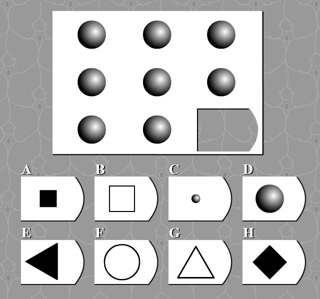
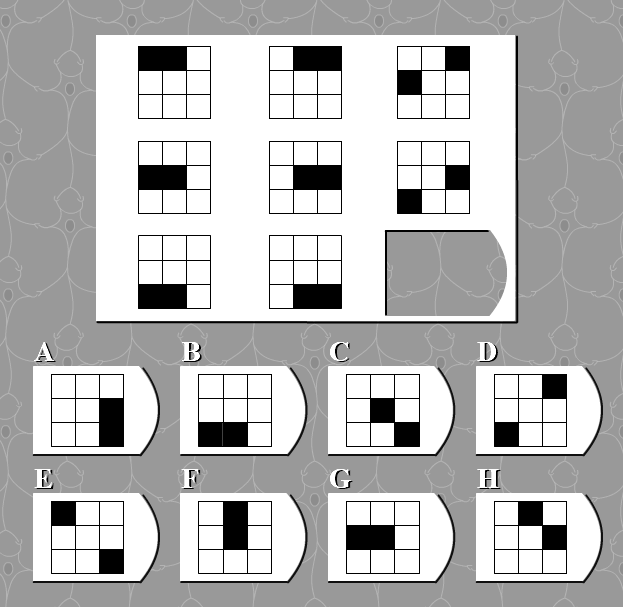
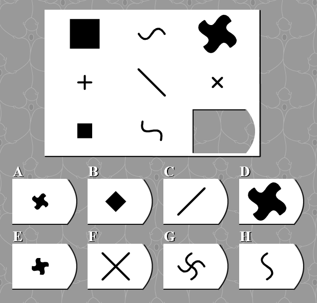
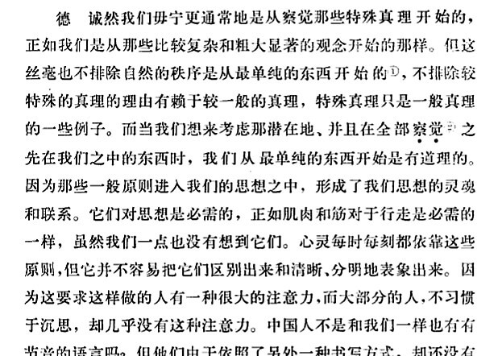
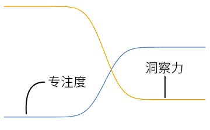

## 从智商测试说起

以前喜欢找各种各样的测试来做，然后与预期的结果相比较、分享给朋友然后与朋友讨论其预测能力。在智商测试中，有一个测试让我印象深刻，因为其测试的内容十分有趣。网址在此，若有兴趣可以做一下：[IQtest.dk](http://iqtest.dk/main.swf)。

一共有 39 道题目，难度大致上是递增的，他们都要求在给出 8 个，预测下一个最可能出现的图形。

第一道题目中，它给出了 8 个相同的球体，让被测者预测下一个图形是什么。

第 19 道题时，预测者则将考虑九宫格内的黑色方块数量、绝对位置、相对位置等因素。

在第 29 题时，被测者则还需要考虑个体的已存 8 个图形相互之间的影响以及属性的组合等因素。

如果你是一个有好奇心的人、或是一个喜欢思考的人，你可能会审视这些谜题，问：「这些问题究竟在考察些什么？」

为了回答这个问题，我们先来考察一个更简单的问题——「这些问题的共同点是什么？」

- 第 1 个问题相信没有人会犹豫，我们看到 8 个相同的球体，那么下一个自然而然也会是一个球体。
- 第 19 个问题，稍加观察即可发现，每一列都可以看作是两个黑色方块的平移，那么第三列方块移动到最底行之下会发生什么？是会反弹？还会是重新回到第一行？还是说还有什么没考虑到？总之，我们又抓住了一些相似点。

能让我们选择出合适图案的，是我们在前面的图案中找到的一些相似的地方、一些不变的地方、一些有规律的地方……或者说，一种「模式」。

这一类有趣问题其实有一个专门的名称——[邦加德问题](https://en.wikipedia.org/wiki/Bongard_problem)，是一名俄罗斯计算机科学家发明的一种谜题，该类问题的核心就在于「模式识别」。

好，现在我们可以再进一步。考虑到难度是划分测试结果的标准，我们可以问——「使难度逐渐增加的因素是什么？」

- 第 1 题之所以简单，是因为「全等」是最容易识别出来的一种模式。
- 第 19 题之所以难一些，是因为它的模式相比第一题更加不好辨认一些。
- 第 29 题的模式相较前两者更加复杂，需要识别的模式的数量也更加多一些。

因此，我们能得出结论使难度增加的是模式的种类、干扰的多少以及模式的数量。

因此，回答最初的问题，该类问题考察的是一种辨别模式的能力——我个人称之为「洞察力」。

## 洞察力

从上面的讨论中可以提取出洞察力的一个良好的定义：**洞察力，即从现象中找到模式的能力**。

洞察力更多的是一种识别出问题的能力而不是一种解决问题的能力，也即莱布尼兹所说的「察觉」的能力。它对解决问题能起作用的关键在于，能迅速对象中蕴含的一般性，若果这一般性能与已有知识产生关联，那么就找到了解决问题的关键。

作为一个例子我们来看阿基米德的顿悟时刻，当泡在浴桶里，看着水溢出浴桶，察觉到溢出的水的体积等于他浸入水的身体的体积。于是某个以前无法解决的难题突然变得清晰明显。

我们之所以需要这种能力，在于对于未经处理的现象，我们只能有一个感性的认识，而不能穿过这层薄膜看到它的本质。对于一个较为复杂的现象——比如上述第 29 题——拥有敏锐洞察力之人能很快从这 8 个图案中把握到其中的种种规律，而对其他人而言这些图形更像是毫无规律的图案。

生活中也有很多类似的例子，比如有的人无论接触什么新鲜的科技，总能很快地上手，而其他人可能熟悉很多数码产品，但是遇到新的产品还是要重新熟悉——比如 Windows 10，尽管其本质与前面的系统别无二致，但是刚开始的时候总能听到有人抱怨说不习惯。

再比如，一个细腻的读者在字里行间体会到了一种不易被发现的感情。

再比如，一个人在社交媒体、新闻资讯里，听到了「历史车轮的转动声」。

再比如，福尔摩斯打量了一下眼前这个陌生人，「我看得出来，您到过阿富汗。」

再比如，哥白尼「看着第谷留下的数据，一道光明突然从心中升起」。

……

## 与洞察力的相关因素

#### 天生因素

不同的人空间感知能力、语言组织能力、因果联系能力、打破常规偏好等等因素各不相同。比如上面的 IQ 测试题，不同的人会得到不同的分数，这就是一个侧面的反应。

#### 休息

有一件事情经常发生：代码出了 bug，耗费数个小时在其中找不到问题出在哪。但转头做点别的事情后再回来看的时候，问题却变得一目了然了。

人似乎有一种倾向，长时间从事一种工作，你的注意力会越来越集中于一个局部上，这有助于提高你的效率，但也会限制你去 Zoom out、以一种跳脱的眼光看待眼前的事物。

做题卡住了？休息一下吧！只要想想世界上有多少灵光一现的想法是在马桶上、散步时、莲蓬头下等等千奇百怪的时刻发现的。

#### 情绪

较低情绪激励状态下的人发挥洞察力的效果较好，这一点似乎是显而易见的。保持平和开放的心境有益于几乎一切认知活动。

#### 元认知

人对于「洞察力」这个概念本身的认识，对于应用洞察力总会是有益的……这也是本文的目的之一。

## 洞察力与经验

常常与洞察力对应出现的一个概念是「经验」，这两个词之间的联系十分密切。

大量的经验有益于提升人的洞察力。比如，在一个严格训练的数学家看来，某一个需要大学生苦苦思索的数学题的答案是显然的。再比如，股票投资顾问和数据分析师能从海量数据中总结出其整体特征，以预测接下来的走势。

但是，仅仅有大量的经验不足以使洞察力提升。使数学家和数据分析师拥有敏锐洞察力的不是简单的经验的堆叠，而是这些经验的融会贯通、是在经验的基础上加以抽象、分析、综合……这就需要超越知觉层面、运用理性来实现了，这也是孔子提倡的「学而思」的道理所在。