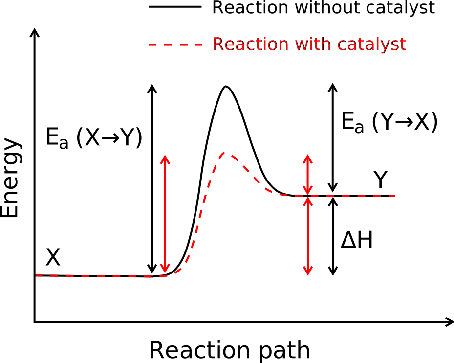
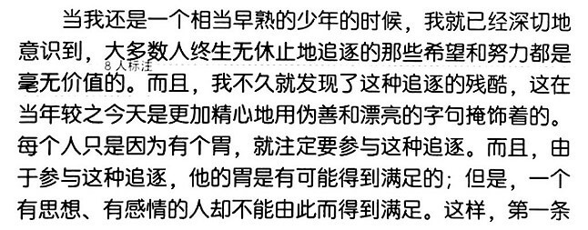

## 催化剂

## 何为催化剂

## 一次化学反应的过程

[过氧化氢](https://zh.wikipedia.org/zh-cn/%E8%BF%87%E6%B0%A7%E5%8C%96%E6%B0%A2)（H2O2）又称双氧水，在常温下，会缓慢分解为水和氧气。这里的缓慢是真正的缓慢，缓慢到从生产出来到你从药店买到手损失掉的量都微不足道。

如果在其中加入二氧化锰，反应会急剧加强，可以从氧气的泡腾明显看出这一点。但是二氧化锰在这个过程中不被消耗，因此可以无限期地重复使用。

在化学中，我们把二氧化锰这种 ① 能加快反应速率，且 ② 本身的质量、组成和化学性质在参加化学反应前后保持不变的物质，称为**催化剂**。

实际上，在整个过程中，二氧化锰并非不参与反应。简单的来说，在与过氧化氢接触时，它会被消耗生成高锰酸：

.svg)

但是紧接着，它又会被进一步的反应重新生成 ：

.svg)

因此其总量保持不变。

## 催化如何成为可能

催化剂使通过一种涉及到[活化能](https://zh.wikipedia.org/wiki/%E6%B4%BB%E5%8C%96%E8%83%BD)的机制发挥作用的。

活化能即激活能量，用于定义一个化学反应的发生所需要克服的能量的障碍。这是一种阈值或者说是一种门槛，活化能越低，反应越容易进行。

一个可以拿来说明活化能概念的例子是生火的过程。木柴是很难被直接点燃的，如果只拿打火机去点，即使能点燃，火光也马上会熄灭。

一般我们点燃木柴的方法是先点燃引火物（比如干草和树皮），并往里吹气，待其引燃小块的木柴，再慢慢添加大块的木柴。在这个过程中，我们通过一系列措施——添加引火物、吹气——使得大木柴更容易被点燃了，这就是降低了它燃烧的阈值、降低了反应的活化能，从而使得同一个打火机的热量下点燃木柴成为可能。

催化剂也是通过降低反应活化能来加快反应速率的，尽管其具体机制要复杂得多。二氧化锰为过氧化氢开辟了一条生成水和氧气的新的道路，相当于拓宽了公路车道，因此反应就降低了反应所需活化能。本来 150℃ 才会发生的剧烈反应在常温下就可以发生了。

## 催化剂与熵

你可能会想：催化剂能降低反应活化能，但是自身却保持不变，原来需要很多能量的反应，现在只需少量能量就能进行，既然能省下来一部分能量？难道这不就是永动机吗？

实际上，一个重要的事实是，催化剂不会使得反应产物变得更多（即不改变反应平衡），因此也不会使所消耗的能量更少。就像是你通过搅拌让一杯水更快地凉下来，并不会使得这杯水冷却到室温以下。

这是[热力学第二定律](https://zh.wikipedia.org/wiki/%E7%83%AD%E5%8A%9B%E5%AD%A6%E7%AC%AC%E4%BA%8C%E5%AE%9A%E5%BE%8B)的一个体现，这个定律说明，热力学系统从一个平衡态到另一平衡态的过程中，其[熵](https://zh.wikipedia.org/wiki/%E7%86%B5)永不减少。这是一个非常宏观的定律。

催化剂在催化过程中，维持着自己的低熵状态，同时促进了熵的增加速率。

有关熵是什么，有一个很好的描述：熵就是系统无序的程度。无序就是平均化，可以想象两种液体的混合。

系统内熵永不减少，意味着无序不会自发地变为有序——散乱的沙堆不会被风吹为城堡的形状、糖块溶解于水中不会自己又凝结出来、火炉会把热量散发到房间的每一个角落但不会吸走热量、不可能把全乱的扑克牌洗成一幅有序的套牌……

这又意味着，要维持系统内某一部分的熵不变（有序），至少需要其他部分的熵增加（混乱）。一台机械，要使它长久地维持功能（有序），必须不断地去维护它，这种维护需要消耗其他资源的能量（混乱）。

例如，我们从大自然中无序的铁矿冶炼出有序的铁块，需要燃烧大量的煤块，煤的有序度就在这个过程中减少了。灰烬、核废料……这些都是非常无序的材料，因为它们曾经拥有的秩序已经被我们赋予其他产品了……使得我们进入工业时代的钢铁，它们的有序度来源于煤矿，煤矿的有序度又来源于远古生物，远古生物的有序度又最终来源于太阳……太阳万岁。

## 人，是会思考的催化剂[^2]

生命，是一个较为有序的结构。所谓生的欲望，便是维持自身的有序的欲望[^1]。我们为了维持自身的有序，便去捕食其他生物的秩序。又通过摄取煤炭与石油的秩序建立起了繁荣的现代文明，建立起这么庞大的秩序实属不易。人类族群在现代化的时代之中长大，教育、饮食、医疗……无不需要摄取大量的有序度才能得以健康成长，这一切都建立在历史长期积累的有序度之上。

然而，这样的一个结晶，要摧毁它却也再简单不过了，几次愚蠢的争端、几发核武器就足以将其抹去。更何况，现代文明如果被摧毁，地球上表层矿产资源已经不足以从头再来一次工业革命了。

我们对于宇宙，不过是促进了能量向不可利用的状态转化。对于我们自己，也不过是不断为了填饱自己的欲望而参与生存的角逐。

然而，我们是有思想的催化剂。人既伟大有渺小，而思想成就人的伟大，使人伟大到知晓自己的渺小与伟大……这便是人的最大幸福与最大不幸[^3]。思想——我们的全部尊严正在于思想，即便是毁灭也无法剥夺人的尊严，而只会使得人类显得更加高贵。[^4]

[^1]: 而有序状态是一种势能的状态，它总是归于无序的尘土，因此我们也有一种死的欲望。
[^2]: 而《人，是会思考的芦苇》
[^3]: 而《过于喧嚣的孤独》
[^4]: 而《少女终末旅行》
